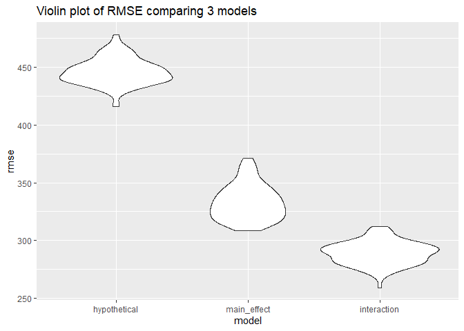

P8105 HW6
================
Chee Kay Cheong
2022-12-03

    ## ── Attaching packages ─────────────────────────────────────── tidyverse 1.3.2 ──
    ## ✔ ggplot2 3.3.6     ✔ purrr   0.3.4
    ## ✔ tibble  3.1.8     ✔ dplyr   1.0.9
    ## ✔ tidyr   1.2.1     ✔ stringr 1.4.1
    ## ✔ readr   2.1.2     ✔ forcats 0.5.2
    ## ── Conflicts ────────────────────────────────────────── tidyverse_conflicts() ──
    ## ✖ dplyr::filter() masks stats::filter()
    ## ✖ dplyr::lag()    masks stats::lag()
    ## Loading required package: nlme
    ## 
    ## 
    ## Attaching package: 'nlme'
    ## 
    ## 
    ## The following object is masked from 'package:dplyr':
    ## 
    ##     collapse
    ## 
    ## 
    ## This is mgcv 1.8-40. For overview type 'help("mgcv-package")'.

## Problem 2

Load and clean the `homicide` dataset:

``` r
homicide = 
  read_csv("./Data/homicide_data.csv") %>% 
  janitor::clean_names() %>% 
  mutate(
    across(c(victim_age, victim_sex, victim_race), na_if, "Unknown")) %>% 
  mutate(
    victim_age = as.numeric(victim_age),
    reported_date = as.character(reported_date),
    reported_date = as.Date(reported_date, format = "%Y%m%d"),
    state = str_replace(state, "w", "W"),
    case_solved = ifelse(disposition == "Closed by arrest", 1, 0)) %>%
  unite(col = 'city_state', c('city', 'state'), sep = ', ') %>% 
  subset(!city_state %in% c("Dallas, TX", "Phoenix, AZ", "Kansas City, MO", "Tulsa, AL")) %>% 
  subset(victim_race %in% c("White", "Black"))
```

##### Baltimore, MD

``` r
baltimore = 
  homicide %>% 
  filter(
    city_state == "Baltimore, MD") %>%
  mutate(
    victim_race = fct_relevel(victim_race, "White")) %>% 
  select(case_solved, victim_age, victim_sex, victim_race)
```

``` r
logreg_balti = 
  baltimore %>% 
  glm(case_solved ~ victim_age + victim_sex + victim_race, data = . , family = binomial()) %>% 
  broom::tidy() %>% 
  mutate(
    OR = exp(estimate),
    CI_lower = exp(estimate - 1.96 * std.error),
    CI_upper = exp(estimate + 1.96 * std.error))

logreg_balti %>% 
  select(-std.error, -statistic) %>% 
  knitr::kable(digits = 2)
```

| term             | estimate | p.value |   OR | CI_lower | CI_upper |
|:-----------------|---------:|--------:|-----:|---------:|---------:|
| (Intercept)      |     1.15 |    0.00 | 3.16 |     1.99 |     5.03 |
| victim_age       |    -0.01 |    0.04 | 0.99 |     0.99 |     1.00 |
| victim_sexMale   |    -0.85 |    0.00 | 0.43 |     0.32 |     0.56 |
| victim_raceBlack |    -0.84 |    0.00 | 0.43 |     0.31 |     0.61 |

##### All cities

``` r
all_cities = 
  homicide %>% 
    nest(df = -city_state) %>% 
    mutate(
    # Create a new variable that map the logistic regression function to each of the cities.
      models = map(.x = df, ~glm(case_solved ~ victim_age + victim_sex + victim_race, data = . , family = binomial())),
    # Then, create another variable that shows the tidy results of the logistic regression.
      results = map(models, broom::tidy)) %>% 
  select(city_state, results) %>% 
  unnest(results) %>%
  filter(term == "victim_sexMale") %>% 
  mutate(
    OR = exp(estimate),
    CI_lower = exp(estimate - 1.96 * std.error),
    CI_upper = exp(estimate + 1.96 * std.error))
```

``` r
all_cities %>% 
  select(city_state, term, OR, CI_lower, CI_upper) %>% 
  mutate(
    city_state = fct_reorder(city_state, OR)) %>% 
  ggplot(aes(x = OR, y = city_state)) + 
    geom_vline(aes(xintercept = 1), size = 0.25, linetype = "dashed") + 
    geom_errorbar(aes(xmax = CI_upper, xmin = CI_lower), size = 0.5, height = 0.2, color = "gray50") +
    geom_point(size = 1.5, color = "orange") +
    theme_bw()+
    theme(panel.grid.minor = element_blank()) +
  labs(
    y = "City, State",
    x = "Odds ratio",
    title = "Odds ratio comparing homicide resolved among male to female in each city",
    caption = "data source: Washington Post")
```

<!-- -->

## Problem 3

Load and clean the `birthweight` dataset:

``` r
bwt_df = 
  read_csv("./Data/birthweight.csv") %>% 
  janitor::clean_names() %>% 
  mutate(
    babysex = ifelse(babysex == 1, "Male", "Female"),
    babysex = as.factor(babysex),
    malform = ifelse(malform == 1, "present", "absent"),
    malform = as.factor(malform),
    delwt = delwt * 453.592) # I want to convert pounds to grams because I prefer standard scientific unit.

# I did not change anything for father's & mother's race because I don't plan to use them in my regression model.

skimr::skim(bwt_df)
```

|                                                  |        |
|:-------------------------------------------------|:-------|
| Name                                             | bwt_df |
| Number of rows                                   | 4342   |
| Number of columns                                | 20     |
| \_\_\_\_\_\_\_\_\_\_\_\_\_\_\_\_\_\_\_\_\_\_\_   |        |
| Column type frequency:                           |        |
| factor                                           | 2      |
| numeric                                          | 18     |
| \_\_\_\_\_\_\_\_\_\_\_\_\_\_\_\_\_\_\_\_\_\_\_\_ |        |
| Group variables                                  | None   |

Data summary

**Variable type: factor**

| skim_variable | n_missing | complete_rate | ordered | n_unique | top_counts           |
|:--------------|----------:|--------------:|:--------|---------:|:---------------------|
| babysex       |         0 |             1 | FALSE   |        2 | Mal: 2230, Fem: 2112 |
| malform       |         0 |             1 | FALSE   |        2 | abs: 4327, pre: 15   |

**Variable type: numeric**

| skim_variable | n_missing | complete_rate |     mean |       sd |       p0 |      p25 |      p50 |      p75 |     p100 | hist  |
|:--------------|----------:|--------------:|---------:|---------:|---------:|---------:|---------:|---------:|---------:|:------|
| bhead         |         0 |             1 |    33.65 |     1.62 |    21.00 |    33.00 |    34.00 |    35.00 |     41.0 | ▁▁▆▇▁ |
| blength       |         0 |             1 |    49.75 |     2.72 |    20.00 |    48.00 |    50.00 |    51.00 |     63.0 | ▁▁▁▇▁ |
| bwt           |         0 |             1 |  3114.40 |   512.15 |   595.00 |  2807.00 |  3132.50 |  3459.00 |   4791.0 | ▁▁▇▇▁ |
| delwt         |         0 |             1 | 66030.33 | 10073.29 | 39008.91 | 59420.55 | 64863.66 | 71213.94 | 151499.7 | ▅▇▁▁▁ |
| fincome       |         0 |             1 |    44.11 |    25.98 |     0.00 |    25.00 |    35.00 |    65.00 |     96.0 | ▃▇▅▂▃ |
| frace         |         0 |             1 |     1.66 |     0.85 |     1.00 |     1.00 |     2.00 |     2.00 |      8.0 | ▇▁▁▁▁ |
| gaweeks       |         0 |             1 |    39.43 |     3.15 |    17.70 |    38.30 |    39.90 |    41.10 |     51.3 | ▁▁▂▇▁ |
| menarche      |         0 |             1 |    12.51 |     1.48 |     0.00 |    12.00 |    12.00 |    13.00 |     19.0 | ▁▁▂▇▁ |
| mheight       |         0 |             1 |    63.49 |     2.66 |    48.00 |    62.00 |    63.00 |    65.00 |     77.0 | ▁▁▇▂▁ |
| momage        |         0 |             1 |    20.30 |     3.88 |    12.00 |    18.00 |    20.00 |    22.00 |     44.0 | ▅▇▂▁▁ |
| mrace         |         0 |             1 |     1.63 |     0.77 |     1.00 |     1.00 |     2.00 |     2.00 |      4.0 | ▇▇▁▁▁ |
| parity        |         0 |             1 |     0.00 |     0.10 |     0.00 |     0.00 |     0.00 |     0.00 |      6.0 | ▇▁▁▁▁ |
| pnumlbw       |         0 |             1 |     0.00 |     0.00 |     0.00 |     0.00 |     0.00 |     0.00 |      0.0 | ▁▁▇▁▁ |
| pnumsga       |         0 |             1 |     0.00 |     0.00 |     0.00 |     0.00 |     0.00 |     0.00 |      0.0 | ▁▁▇▁▁ |
| ppbmi         |         0 |             1 |    21.57 |     3.18 |    13.07 |    19.53 |    21.03 |    22.91 |     46.1 | ▃▇▁▁▁ |
| ppwt          |         0 |             1 |   123.49 |    20.16 |    70.00 |   110.00 |   120.00 |   134.00 |    287.0 | ▅▇▁▁▁ |
| smoken        |         0 |             1 |     4.15 |     7.41 |     0.00 |     0.00 |     0.00 |     5.00 |     60.0 | ▇▁▁▁▁ |
| wtgain        |         0 |             1 |    22.08 |    10.94 |   -46.00 |    15.00 |    22.00 |    28.00 |     89.0 | ▁▁▇▁▁ |

##### Proposed regression model for birthweight

Outcome of interest: `bwt` (baby’s birthweight - grams)

Predictors of interest:  
\* `delwt` (mother’s weight at delivery - grams) \* `fincome` (family
monthly income - in hundreds, rounded) \* `gaweeks` (gestational age in
weeks)  
\* `momage` (mother’s age at delivery - years)

Proposed linear regression model:

Birthweight = intercept + beta1(`delwt`) + beta2(`fincome`) +
beta3(`gaweeks`) + beta4(`momage`)

``` r
hypo_df = 
  bwt_df %>% 
  select(bwt, delwt, fincome, gaweeks, momage)

hypo_model = 
  hypo_df %>% 
  lm(bwt ~ delwt + fincome + gaweeks + momage, data = .)

hypo_model %>% 
  broom::tidy() %>% 
  knitr::kable(digits = 2)
```

| term        | estimate | std.error | statistic | p.value |
|:------------|---------:|----------:|----------:|--------:|
| (Intercept) |  -235.64 |     94.90 |     -2.48 |    0.01 |
| delwt       |     0.01 |      0.00 |     17.62 |    0.00 |
| fincome     |     1.81 |      0.28 |      6.56 |    0.00 |
| gaweeks     |    59.71 |      2.18 |     27.34 |    0.00 |
| momage      |     6.17 |      1.86 |      3.32 |    0.00 |

``` r
summary(hypo_model)
```

    ## 
    ## Call:
    ## lm(formula = bwt ~ delwt + fincome + gaweeks + momage, data = .)
    ## 
    ## Residuals:
    ##      Min       1Q   Median       3Q      Max 
    ## -1859.29  -280.83     3.12   283.07  1609.30 
    ## 
    ## Coefficients:
    ##               Estimate Std. Error t value Pr(>|t|)    
    ## (Intercept) -2.356e+02  9.490e+01  -2.483   0.0131 *  
    ## delwt        1.197e-02  6.796e-04  17.619  < 2e-16 ***
    ## fincome      1.814e+00  2.766e-01   6.559 6.06e-11 ***
    ## gaweeks      5.971e+01  2.184e+00  27.338  < 2e-16 ***
    ## momage       6.170e+00  1.857e+00   3.322   0.0009 ***
    ## ---
    ## Signif. codes:  0 '***' 0.001 '**' 0.01 '*' 0.05 '.' 0.1 ' ' 1
    ## 
    ## Residual standard error: 446.7 on 4337 degrees of freedom
    ## Multiple R-squared:   0.24,  Adjusted R-squared:  0.2393 
    ## F-statistic: 342.3 on 4 and 4337 DF,  p-value: < 2.2e-16

``` r
hypo_add = 
  hypo_df %>% 
  mutate(
  add_residuals(hypo_df, hypo_model),
  add_predictions(hypo_df, hypo_model))

hypo_add %>% 
ggplot(aes(x = pred, y = resid)) +
  geom_point() +
  labs(
    title = 'Residual vs. Predicted Values Plot', 
    x = 'Predicted Values', 
    y = 'Residuals')
```

<!-- -->

#### Compare different models

``` r
cv_df = 
  crossv_mc(bwt_df, 100) %>%
  mutate(
    train = map(train, as.tibble),
    test = map(test, as.tibble)) %>% 
  mutate(
    hypo_mod = map(.x = train, ~lm(bwt ~ delwt + fincome + gaweeks + momage, data = .x)), 
    main_mod = map(.x = train, ~lm(bwt ~ blength + gaweeks, data = .x)), 
    inter_mod = map(.x = train, ~lm(bwt ~ (bhead + blength + babysex + bhead*blength + bhead*babysex + blength*babysex + bhead*blength*babysex), data = .x))) %>% 
  mutate(
    rmse_hypothetical = map2_dbl(.x = hypo_mod, .y = test, ~rmse(model = .x, data = .y)),
    rmse_main_effect = map2_dbl(.x = main_mod, .y = test, ~rmse(model = .x, data = .y)),
    rmse_interaction = map2_dbl(.x = inter_mod, .y = test, ~rmse(model = .x, data = .y)))

cv_df %>% 
  select(starts_with("rmse")) %>% 
  pivot_longer(
    everything(),
    names_to = "model", 
    values_to = "rmse",
    names_prefix = "rmse_") %>% 
  mutate(model = fct_inorder(model)) %>% 
  ggplot(aes(x = model, y = rmse)) + 
  geom_violin() +
  labs(
    x = "model",
    y = "rmse",
    title = "Violin plot of RMSE comparing 3 models")
```

<!-- -->

``` r
cv_df %>% 
  select(starts_with("rmse")) %>% 
  pivot_longer(
    everything(),
    names_to = "model", 
    values_to = "rmse",
    names_prefix = "rmse_") %>% 
  group_by(model) %>% 
  summarize(mean(rmse)) %>% 
  mutate(mean_rmse = `mean(rmse)`) %>% 
  select(-`mean(rmse)`) %>% 
  knitr::kable(digits = 2)
```

| model        | mean_rmse |
|:-------------|----------:|
| hypothetical |    446.15 |
| interaction  |    289.14 |
| main_effect  |    333.01 |
