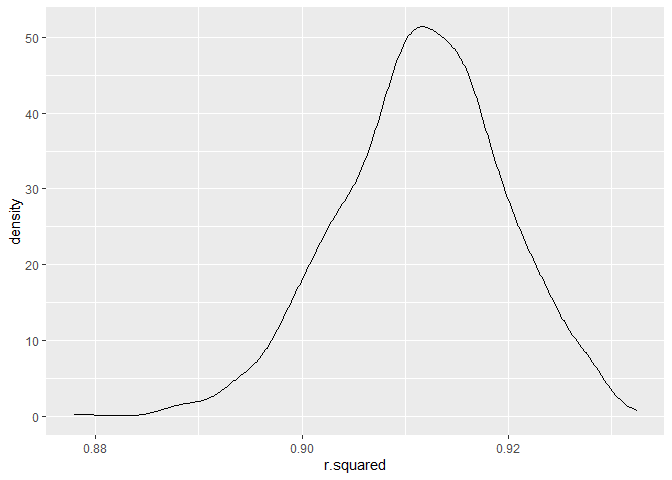
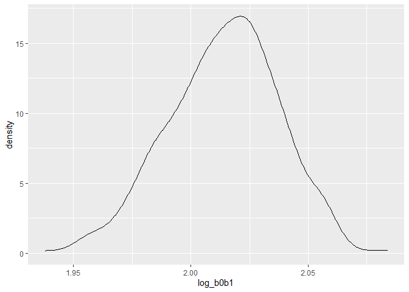

P8105 HW6
================
Chee Kay Cheong
2022-12-03

    ## ── Attaching packages ─────────────────────────────────────── tidyverse 1.3.2 ──
    ## ✔ ggplot2 3.3.6     ✔ purrr   0.3.4
    ## ✔ tibble  3.1.8     ✔ dplyr   1.0.9
    ## ✔ tidyr   1.2.1     ✔ stringr 1.4.1
    ## ✔ readr   2.1.2     ✔ forcats 0.5.2
    ## ── Conflicts ────────────────────────────────────────── tidyverse_conflicts() ──
    ## ✖ dplyr::filter() masks stats::filter()
    ## ✖ dplyr::lag()    masks stats::lag()
    ## Loading required package: nlme
    ## 
    ## 
    ## Attaching package: 'nlme'
    ## 
    ## 
    ## The following object is masked from 'package:dplyr':
    ## 
    ##     collapse
    ## 
    ## 
    ## This is mgcv 1.8-40. For overview type 'help("mgcv-package")'.

## Problem 1

To obtain a distribution for $\hat{r}^2$, we’ll follow basically the
same procedure we used for regression coefficients: draw bootstrap
samples; then a model to each; extract the value I’m concerned with; and
summarize. Here, we’ll use `modelr::bootstrap` to draw the samples and
`broom::glance` to produce `r.squared` values.

``` r
weather_df = 
  rnoaa::meteo_pull_monitors(
    c("USW00094728"),
    var = c("PRCP", "TMIN", "TMAX"), 
    date_min = "2017-01-01",
    date_max = "2017-12-31") %>%
  mutate(
    name = recode(id, USW00094728 = "CentralPark_NY"),
    tmin = tmin / 10,
    tmax = tmax / 10) %>%
  select(name, id, everything())
```

``` r
weather_df %>% 
  modelr::bootstrap(n = 1000) %>% 
  mutate(
    models = map(strap, ~lm(tmax ~ tmin, data = .x) ),
    results = map(models, broom::glance)) %>% 
  select(-strap, -models) %>% 
  unnest(results) %>% 
  ggplot(aes(x = r.squared)) + geom_density()
```

<!-- -->

In this example, the $\hat{r}^2$ value is high, and the upper bound at 1
may be a cause for the generally skewed shape of the distribution. If we
wanted to construct a confidence interval for $R^2$, we could take the
2.5% and 97.5% quantiles of the estimates across bootstrap samples.
However, because the shape isn’t symmetric, using the mean +/- 1.96
times the standard error probably wouldn’t work well.

We can produce a distribution for $\log(\beta_0 * \beta1)$ using a
similar approach, with a bit more wrangling before we make our plot.

``` r
weather_df %>% 
  modelr::bootstrap(n = 1000) %>% 
  mutate(
    models = map(strap, ~lm(tmax ~ tmin, data = .x) ),
    results = map(models, broom::tidy)) %>% 
  select(-strap, -models) %>% 
  unnest(results) %>% 
  select(id = `.id`, term, estimate) %>% 
  pivot_wider(
    names_from = term, 
    values_from = estimate) %>% 
  rename(beta0 = `(Intercept)`, beta1 = tmin) %>% 
  mutate(log_b0b1 = log(beta0 * beta1)) %>% 
  ggplot(aes(x = log_b0b1)) + geom_density()
```

<!-- -->

As with $r^2$, this distribution is somewhat skewed and has some
outliers.

The point of this is not to say you should always use the bootstrap –
it’s possible to establish “large sample” distributions for strange
parameters / values / summaries in a lot of cases, and those are great
to have. But it is helpful to know that there’s a way to do inference
even in tough cases.

## Problem 2

Load and clean the `homicide` dataset:

``` r
homicide = 
  read_csv("./Data/homicide_data.csv") %>% 
  janitor::clean_names() %>% 
  mutate(
  # I didn't drop any missing values, but I converted all "Unknown" in these three columns to real 'NA' that is recognized by R.
    across(c(victim_age, victim_sex, victim_race), na_if, "Unknown")) %>% 
  mutate(
    victim_age = as.numeric(victim_age),
    reported_date = as.character(reported_date),
    reported_date = as.Date(reported_date, format = "%Y%m%d"),
    state = str_replace(state, "w", "W"),
    case_solved = ifelse(disposition == "Closed by arrest", 1, 0),
    case_solved = as.factor(case_solved)) %>%
  unite(col = 'city_state', c('city', 'state'), sep = ', ') %>% 
  subset(!city_state %in% c("Dallas, TX", "Phoenix, AZ", "Kansas City, MO", "Tulsa, AL")) %>% 
  subset(victim_race %in% c("White", "Black"))
```

I created a new variable named `case_solved` in which if any cases were
“*Open/No arrest*” or “*closed without arrest*” it will be coded as `0`,
while if any cases were “*Closed by arrest*” it will be coded as `1`.

`1` means resolved, whereas `0` means unresolved.

##### Baltimore, MD

I would like to create a smaller dataset named `baltimore` which
contains only information about the city of Baltimore, MD.

``` r
baltimore = 
  homicide %>% 
  filter(
    city_state == "Baltimore, MD") %>%
  mutate(
  # I releveled the victim's race, so that "White" becomes the reference group.
    victim_race = fct_relevel(victim_race, "White")) %>% 
  select(case_solved, victim_age, victim_sex, victim_race)
```

Then, I would fit a logistic regression to obtain the adjusted odds
ratio for solving homicides comparing male victims to female victims,
keeping all other variables fixed.

``` r
logreg_balti = 
  baltimore %>% 
  glm(case_solved ~ victim_age + victim_sex + victim_race, data = . , family = binomial()) %>% 
  broom::tidy() %>% 
  mutate(
    OR = exp(estimate),
    CI_lower = exp(estimate - 1.96 * std.error),
    CI_upper = exp(estimate + 1.96 * std.error))

logreg_balti %>% 
  select(term, OR, CI_lower, CI_upper) %>% 
  filter(term == "victim_sexMale") %>% 
  knitr::kable(digits = 2)
```

| term           |   OR | CI_lower | CI_upper |
|:---------------|-----:|---------:|---------:|
| victim_sexMale | 0.43 |     0.32 |     0.56 |

The adjusted odds ratio for solving homicides comparing male victims to
female victims is 0.43, and the adjusted 95% confidence interval is 0.32
to 0.56. In Baltimore, MD, the odds of solving homicides among males is
57% lower than the odds of solving homicides among females, and we are
95% confident that the true odds ratio lies between 0.32 and 0.56.

##### All cities

Next, I fitted a logistic regression model for each of the cities in the
`homicide` dataset and extract the adjusted odds ratio and 95% CI for
solving homicides comparing male victims to female victims.

``` r
all_cities = 
  homicide %>% 
    nest(df = -city_state) %>% 
    mutate(
    # Create a new variable that map the logistic regression function to each of the cities.
      models = map(.x = df, ~glm(case_solved ~ victim_age + victim_sex + victim_race, data = . , family = binomial())),
    # Then, create another variable that shows the tidy results of the logistic regression.
      results = map(models, broom::tidy)) %>% 
  select(city_state, results) %>% 
  unnest(results) %>%
  filter(term == "victim_sexMale") %>% 
  mutate(
    OR = exp(estimate),
    CI_lower = exp(estimate - 1.96 * std.error),
    CI_upper = exp(estimate + 1.96 * std.error))

all_cities %>% 
  select(city_state, term, OR, CI_lower, CI_upper) %>%
  knitr::kable(digits = 2)
```

| city_state         | term           |   OR | CI_lower | CI_upper |
|:-------------------|:---------------|-----:|---------:|---------:|
| Albuquerque, NM    | victim_sexMale | 1.77 |     0.83 |     3.76 |
| Atlanta, GA        | victim_sexMale | 1.00 |     0.68 |     1.46 |
| Baltimore, MD      | victim_sexMale | 0.43 |     0.32 |     0.56 |
| Baton Rouge, LA    | victim_sexMale | 0.38 |     0.21 |     0.70 |
| Birmingham, AL     | victim_sexMale | 0.87 |     0.57 |     1.32 |
| Boston, MA         | victim_sexMale | 0.67 |     0.35 |     1.26 |
| Buffalo, NY        | victim_sexMale | 0.52 |     0.29 |     0.94 |
| Charlotte, NC      | victim_sexMale | 0.88 |     0.56 |     1.40 |
| Chicago, IL        | victim_sexMale | 0.41 |     0.34 |     0.50 |
| Cincinnati, OH     | victim_sexMale | 0.40 |     0.24 |     0.68 |
| Columbus, OH       | victim_sexMale | 0.53 |     0.38 |     0.75 |
| Denver, CO         | victim_sexMale | 0.48 |     0.24 |     0.97 |
| Detroit, MI        | victim_sexMale | 0.58 |     0.46 |     0.73 |
| Durham, NC         | victim_sexMale | 0.81 |     0.39 |     1.68 |
| Fort Worth, TX     | victim_sexMale | 0.67 |     0.40 |     1.13 |
| Fresno, CA         | victim_sexMale | 1.34 |     0.58 |     3.07 |
| Houston, TX        | victim_sexMale | 0.71 |     0.56 |     0.91 |
| Indianapolis, IN   | victim_sexMale | 0.92 |     0.68 |     1.24 |
| Jacksonville, FL   | victim_sexMale | 0.72 |     0.54 |     0.97 |
| Las Vegas, NV      | victim_sexMale | 0.84 |     0.61 |     1.15 |
| Long Beach, CA     | victim_sexMale | 0.41 |     0.16 |     1.08 |
| Los Angeles, CA    | victim_sexMale | 0.66 |     0.46 |     0.96 |
| Louisville, KY     | victim_sexMale | 0.49 |     0.30 |     0.79 |
| Memphis, TN        | victim_sexMale | 0.72 |     0.53 |     0.99 |
| Miami, FL          | victim_sexMale | 0.52 |     0.30 |     0.87 |
| Milwaukee, WI      | victim_sexMale | 0.73 |     0.50 |     1.06 |
| Minneapolis, MN    | victim_sexMale | 0.95 |     0.48 |     1.87 |
| Nashville, TN      | victim_sexMale | 1.03 |     0.68 |     1.56 |
| New Orleans, LA    | victim_sexMale | 0.58 |     0.42 |     0.81 |
| New York, NY       | victim_sexMale | 0.26 |     0.14 |     0.50 |
| Oakland, CA        | victim_sexMale | 0.56 |     0.37 |     0.87 |
| Oklahoma City, OK  | victim_sexMale | 0.97 |     0.62 |     1.52 |
| Omaha, NE          | victim_sexMale | 0.38 |     0.20 |     0.72 |
| Philadelphia, PA   | victim_sexMale | 0.50 |     0.38 |     0.65 |
| Pittsburgh, PA     | victim_sexMale | 0.43 |     0.27 |     0.70 |
| Richmond, VA       | victim_sexMale | 1.01 |     0.50 |     2.03 |
| San Antonio, TX    | victim_sexMale | 0.70 |     0.40 |     1.25 |
| Sacramento, CA     | victim_sexMale | 0.67 |     0.33 |     1.34 |
| Savannah, GA       | victim_sexMale | 0.87 |     0.42 |     1.78 |
| San Bernardino, CA | victim_sexMale | 0.50 |     0.17 |     1.46 |
| San Diego, CA      | victim_sexMale | 0.41 |     0.20 |     0.85 |
| San Francisco, CA  | victim_sexMale | 0.61 |     0.32 |     1.17 |
| St. Louis, MO      | victim_sexMale | 0.70 |     0.53 |     0.93 |
| Stockton, CA       | victim_sexMale | 1.35 |     0.62 |     2.94 |
| Tampa, FL          | victim_sexMale | 0.81 |     0.35 |     1.88 |
| Tulsa, OK          | victim_sexMale | 0.98 |     0.61 |     1.55 |
| Washington, DC     | victim_sexMale | 0.69 |     0.47 |     1.02 |

Then, I created a plot that shows the estimated ORs and CIs for each
city.

``` r
all_cities %>% 
  select(city_state, term, OR, CI_lower, CI_upper) %>% 
  mutate(
    city_state = fct_reorder(city_state, OR)) %>% 
  ggplot(aes(x = OR, y = city_state)) + 
    geom_vline(aes(xintercept = 1), size = 0.25, linetype = "dashed") + 
    geom_errorbar(aes(xmax = CI_upper, xmin = CI_lower), size = 0.5, height = 0.2, color = "gray50") +
    geom_point(size = 1.5, color = "orange") +
    theme_bw()+
    theme(panel.grid.minor = element_blank()) +
  labs(
    y = "City, State",
    x = "Odds ratio",
    title = "Odds ratio comparing homicide resolved among male to female in each city",
    caption = "data source: Washington Post")
```

<!-- -->

## Problem 3

Load and clean the `birthweight` dataset:

``` r
bwt_df = 
  read_csv("./Data/birthweight.csv") %>% 
  janitor::clean_names() %>% 
  mutate(
    babysex = ifelse(babysex == 1, "Male", "Female"),
    babysex = as.factor(babysex),
    malform = ifelse(malform == 1, "present", "absent"),
    malform = as.factor(malform),
    # I did not label father's and mother's races because it is too much work...
    frace = as.factor(frace),
    mrace = as.factor(mrace),
    # I want to convert pounds to grams because I prefer standard scientific unit. 
    # Also, I did this to keep the unit of weight the same across the dataset.
    delwt = delwt * 453.592) 

skimr::skim(bwt_df)
```

|                                                  |        |
|:-------------------------------------------------|:-------|
| Name                                             | bwt_df |
| Number of rows                                   | 4342   |
| Number of columns                                | 20     |
| \_\_\_\_\_\_\_\_\_\_\_\_\_\_\_\_\_\_\_\_\_\_\_   |        |
| Column type frequency:                           |        |
| factor                                           | 4      |
| numeric                                          | 16     |
| \_\_\_\_\_\_\_\_\_\_\_\_\_\_\_\_\_\_\_\_\_\_\_\_ |        |
| Group variables                                  | None   |

Data summary

**Variable type: factor**

| skim_variable | n_missing | complete_rate | ordered | n_unique | top_counts                      |
|:--------------|----------:|--------------:|:--------|---------:|:--------------------------------|
| babysex       |         0 |             1 | FALSE   |        2 | Mal: 2230, Fem: 2112            |
| frace         |         0 |             1 | FALSE   |        5 | 1: 2123, 2: 1911, 4: 248, 3: 46 |
| malform       |         0 |             1 | FALSE   |        2 | abs: 4327, pre: 15              |
| mrace         |         0 |             1 | FALSE   |        4 | 1: 2147, 2: 1909, 4: 243, 3: 43 |

**Variable type: numeric**

| skim_variable | n_missing | complete_rate |     mean |       sd |       p0 |      p25 |      p50 |      p75 |     p100 | hist  |
|:--------------|----------:|--------------:|---------:|---------:|---------:|---------:|---------:|---------:|---------:|:------|
| bhead         |         0 |             1 |    33.65 |     1.62 |    21.00 |    33.00 |    34.00 |    35.00 |     41.0 | ▁▁▆▇▁ |
| blength       |         0 |             1 |    49.75 |     2.72 |    20.00 |    48.00 |    50.00 |    51.00 |     63.0 | ▁▁▁▇▁ |
| bwt           |         0 |             1 |  3114.40 |   512.15 |   595.00 |  2807.00 |  3132.50 |  3459.00 |   4791.0 | ▁▁▇▇▁ |
| delwt         |         0 |             1 | 66030.33 | 10073.29 | 39008.91 | 59420.55 | 64863.66 | 71213.94 | 151499.7 | ▅▇▁▁▁ |
| fincome       |         0 |             1 |    44.11 |    25.98 |     0.00 |    25.00 |    35.00 |    65.00 |     96.0 | ▃▇▅▂▃ |
| gaweeks       |         0 |             1 |    39.43 |     3.15 |    17.70 |    38.30 |    39.90 |    41.10 |     51.3 | ▁▁▂▇▁ |
| menarche      |         0 |             1 |    12.51 |     1.48 |     0.00 |    12.00 |    12.00 |    13.00 |     19.0 | ▁▁▂▇▁ |
| mheight       |         0 |             1 |    63.49 |     2.66 |    48.00 |    62.00 |    63.00 |    65.00 |     77.0 | ▁▁▇▂▁ |
| momage        |         0 |             1 |    20.30 |     3.88 |    12.00 |    18.00 |    20.00 |    22.00 |     44.0 | ▅▇▂▁▁ |
| parity        |         0 |             1 |     0.00 |     0.10 |     0.00 |     0.00 |     0.00 |     0.00 |      6.0 | ▇▁▁▁▁ |
| pnumlbw       |         0 |             1 |     0.00 |     0.00 |     0.00 |     0.00 |     0.00 |     0.00 |      0.0 | ▁▁▇▁▁ |
| pnumsga       |         0 |             1 |     0.00 |     0.00 |     0.00 |     0.00 |     0.00 |     0.00 |      0.0 | ▁▁▇▁▁ |
| ppbmi         |         0 |             1 |    21.57 |     3.18 |    13.07 |    19.53 |    21.03 |    22.91 |     46.1 | ▃▇▁▁▁ |
| ppwt          |         0 |             1 |   123.49 |    20.16 |    70.00 |   110.00 |   120.00 |   134.00 |    287.0 | ▅▇▁▁▁ |
| smoken        |         0 |             1 |     4.15 |     7.41 |     0.00 |     0.00 |     0.00 |     5.00 |     60.0 | ▇▁▁▁▁ |
| wtgain        |         0 |             1 |    22.08 |    10.94 |   -46.00 |    15.00 |    22.00 |    28.00 |     89.0 | ▁▁▇▁▁ |

``` r
# No missing values across the dataset.
```

The `bwt_df` dataset contains 20 variables and 4342 observations. 4 of
the variables (`babysex`, `malform`, `frace`, and `mrace`)are factor
vectors, while all other variables are numeric vectors.

##### Proposed regression model for birthweight

Outcome of interest: `bwt` (baby’s birthweight - grams)

Predictors of interest:  
\* `delwt` (mother’s weight at delivery - grams)  
I picked this variable as one of the predictors because I think mother’s
weight at delivery could have some effect on baby’s birthweight. The
heavier the mother’s weight at delivery, the heavier the baby’s
birthweight.

- `fincome` (family monthly income - in hundreds, rounded)  
  Family income can reflect the mother’s SES, which can serve as a
  social factor of babies birthweight. The lower the family income of a
  mother, the lower the baby’s birthweight.

- `gaweeks` (gestational age in weeks)  
  I hypothesized that fewer gestational age results in lower baby
  birthweight.

- `momage` (mother’s age at delivery - years)  
  Several literature reviews suggest that baby birthweight is negatively
  associated with mother’s age at delivery.

Proposed linear regression model:

Birthweight = intercept + beta1(`delwt`) + beta2(`fincome`) +
beta3(`gaweeks`) + beta4(`momage`)

First, I created a dataset that only contains the variables that I need
for my hypothetical model. Because both the outcome and predictors of
interest are continuous variables, I used a linear regression for my
hypothesized model.

``` r
hypo_df = 
  bwt_df %>% 
  select(bwt, delwt, fincome, gaweeks, momage)

hypo_model = 
  hypo_df %>% 
  lm(bwt ~ delwt + fincome + gaweeks + momage, data = .)

hypo_model %>% 
  broom::tidy() %>% 
  knitr::kable(digits = 2)
```

| term        | estimate | std.error | statistic | p.value |
|:------------|---------:|----------:|----------:|--------:|
| (Intercept) |  -235.64 |     94.90 |     -2.48 |    0.01 |
| delwt       |     0.01 |      0.00 |     17.62 |    0.00 |
| fincome     |     1.81 |      0.28 |      6.56 |    0.00 |
| gaweeks     |    59.71 |      2.18 |     27.34 |    0.00 |
| momage      |     6.17 |      1.86 |      3.32 |    0.00 |

``` r
summary(hypo_model)
```

    ## 
    ## Call:
    ## lm(formula = bwt ~ delwt + fincome + gaweeks + momage, data = .)
    ## 
    ## Residuals:
    ##      Min       1Q   Median       3Q      Max 
    ## -1859.29  -280.83     3.12   283.07  1609.30 
    ## 
    ## Coefficients:
    ##               Estimate Std. Error t value Pr(>|t|)    
    ## (Intercept) -2.356e+02  9.490e+01  -2.483   0.0131 *  
    ## delwt        1.197e-02  6.796e-04  17.619  < 2e-16 ***
    ## fincome      1.814e+00  2.766e-01   6.559 6.06e-11 ***
    ## gaweeks      5.971e+01  2.184e+00  27.338  < 2e-16 ***
    ## momage       6.170e+00  1.857e+00   3.322   0.0009 ***
    ## ---
    ## Signif. codes:  0 '***' 0.001 '**' 0.01 '*' 0.05 '.' 0.1 ' ' 1
    ## 
    ## Residual standard error: 446.7 on 4337 degrees of freedom
    ## Multiple R-squared:   0.24,  Adjusted R-squared:  0.2393 
    ## F-statistic: 342.3 on 4 and 4337 DF,  p-value: < 2.2e-16

The adjusted $R^2$ for this hypothetical model is 0.24. About 24% of the
variance in baby’s birthweight can be explained by its linear
relationship with the four selected variables.

Then, I made a plot of model residuals against fitted values:

``` r
hypo_add = 
  hypo_df %>% 
  mutate(
  add_residuals(hypo_df, hypo_model),
  add_predictions(hypo_df, hypo_model))

hypo_add %>% 
ggplot(aes(x = pred, y = resid)) +
  geom_point() +
  labs(
    title = 'Residual vs. Predicted Values Plot', 
    x = 'Predicted Values', 
    y = 'Residuals')
```

<!-- -->

#### Compare different models

Compare my hypothesized model to two others:

- One using length at birth and gestational age as predictors (main
  effects only)
- One using head circumference, length, sex, and all interactions
  (including the three-way interaction) between these

``` r
cv_df = 
  crossv_mc(bwt_df, 100) %>%
  mutate(
    train = map(train, as.tibble),
    test = map(test, as.tibble)) %>% 
  mutate(
    hypo_mod = map(.x = train, ~lm(bwt ~ delwt + fincome + gaweeks + momage, data = .x)), 
    main_mod = map(.x = train, ~lm(bwt ~ blength + gaweeks, data = .x)), 
    inter_mod = map(.x = train, ~lm(bwt ~ (bhead + blength + babysex + bhead*blength + bhead*babysex + blength*babysex + bhead*blength*babysex), data = .x))) %>% 
  mutate(
    rmse_hypothetical = map2_dbl(.x = hypo_mod, .y = test, ~rmse(model = .x, data = .y)),
    rmse_main_effect = map2_dbl(.x = main_mod, .y = test, ~rmse(model = .x, data = .y)),
    rmse_interaction = map2_dbl(.x = inter_mod, .y = test, ~rmse(model = .x, data = .y)))

cv_df %>% 
  select(starts_with("rmse")) %>% 
  pivot_longer(
    everything(),
    names_to = "model", 
    values_to = "rmse",
    names_prefix = "rmse_") %>% 
  mutate(model = fct_inorder(model)) %>% 
  ggplot(aes(x = model, y = rmse)) + 
  geom_violin() +
  labs(
    x = "model",
    y = "rmse",
    title = "Violin plot of RMSE comparing 3 models")
```

<!-- -->

From the Violin plot above, we can see that the interaction model has
the lowest RMSE value among the three models, whereas my hypothesized
model has the highest RMSE value. In conclusion, the interaction model
is the best model to be used as compared to the other two models.

I also created a neat table to show the mean RMSE of the three models:

``` r
cv_df %>% 
  select(starts_with("rmse")) %>% 
  pivot_longer(
    everything(),
    names_to = "model", 
    values_to = "rmse",
    names_prefix = "rmse_") %>% 
  group_by(model) %>% 
  summarize(mean(rmse)) %>% 
  mutate(mean_rmse = `mean(rmse)`) %>% 
  select(-`mean(rmse)`) %>% 
  knitr::kable(digits = 2)
```

| model        | mean_rmse |
|:-------------|----------:|
| hypothetical |    447.74 |
| interaction  |    290.57 |
| main_effect  |    335.70 |
